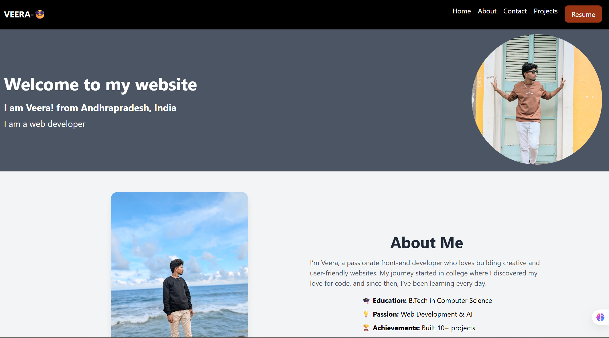

# 🌐 Veera’s Practice Portfolio

A **modern, responsive practice portfolio website** built with **HTML, Tailwind CSS, and JavaScript** to showcase my skills, projects, and experience.  
This is a **practice project** to improve my web development skills — not my final personal portfolio.

---

## ✨ Features

- 🏠 **Hero Section** – A welcoming introduction with my name, role, and profile picture.  
- 🙋‍♂️ **About Me** – A brief overview of my journey, education, and passions.  
- 💼 **Skills** – Highlights of my technical expertise in frontend, backend, and tools.  
- 📂 **Projects Showcase** – 4 fully responsive project cards with titles, short descriptions, and live demo links.  
- 📱 **Responsive Navigation** – Mobile hamburger menu with smooth toggle functionality.  
- 🎨 **Tailwind Styling** – Fast, utility-first styling for a consistent and modern look.  
- ⚡ **Performance Focused** – Lightweight and fast-loading design.  

---

## 🚀 Live Demo
[Click here to view my live practice portfolio](https://yourusername.github.io/your-portfolio/)  

---

## 📸 Screenshots
1. **Desktop View**  
   

---

## 🛠 Technologies Used

- **HTML5** – Semantic markup for structure.  
- **Tailwind CSS** – Utility-first styling for responsive layouts.  
- **JavaScript (ES6+)** – For interactive elements like the mobile menu toggle.  
- **Responsive Design** – Ensures perfect display on mobile, tablet, and desktop.  

---

## ⚙ Installation & Setup

1. **Clone the repository**
   ```bash
   git clone https://github.com/YourUsername/your-portfolio.git


   
